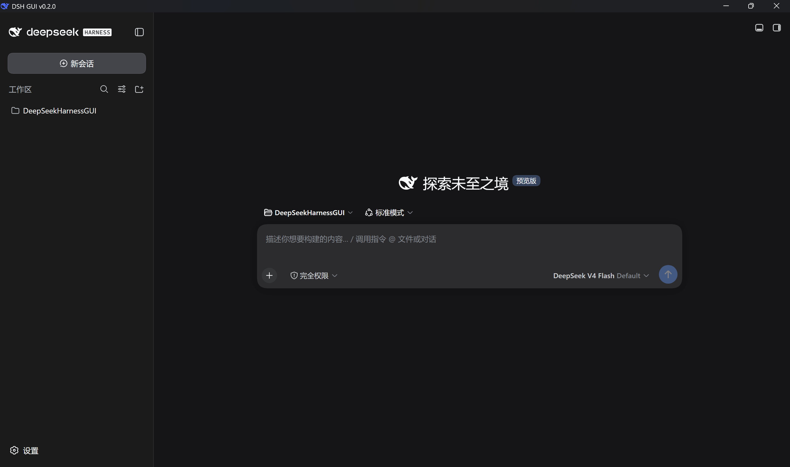
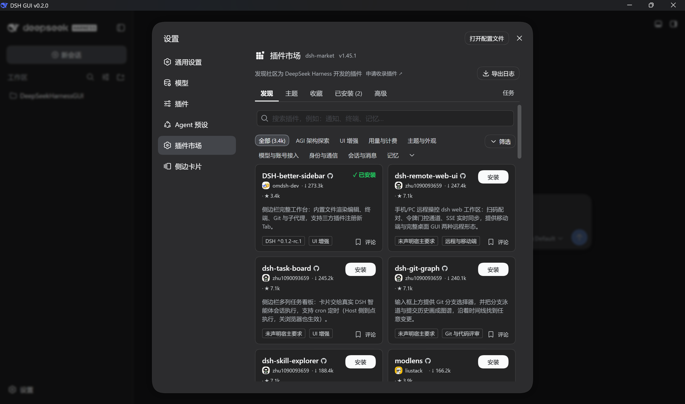
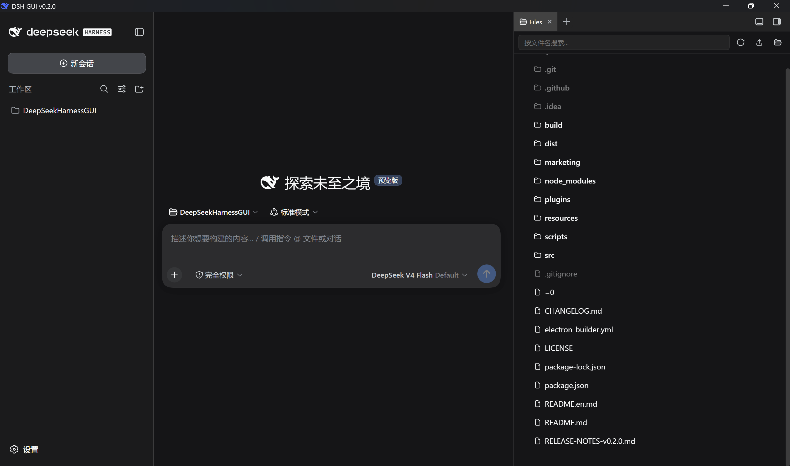

# DSH GUI

> A desktop shell for DeepSeek Harness — embedded Web UI, always-latest engine, portable data directory, and a system tray.

[](README.md)
[](README.en.md)
[](LICENSE)
[](https://github.com/itchenshi/DeepSeekHarnessGUI/releases)
[](https://github.com/itchenshi/DeepSeekHarnessGUI/stargazers)
[]()
[](https://github.com/itchenshi/DeepSeekHarnessGUI)
[](https://gitee.com/itchenshi/DeepSeekHarnessGUI)
[](https://gitcode.com/itchenshi/DeepSeekHarnessGUI)

DSH GUI is an **unofficial** desktop shell for [DeepSeek Harness](https://www.deepseek.com/harness/) (DeepSeek's open-source agent framework, `@deepseek-ai/dsh`, currently a technical preview). It wraps Harness's Web UI in a native window: out-of-the-box, tray-resident, self-updating — while keeping 100% of Harness's capabilities because the shell runs the official engine untouched.

```
┌────────────────────────────────────────────┐
│  DSH GUI (Electron App Shell)             │
│  ├─ Embedded window (Harness UI via dsh web)│
│  ├─ System tray (Open window / Settings / Exit) │
│  ├─ Engine updater (startup + periodic checks) │
│  └─ Data directory (default ~/.dsh, switchable & migratable) │
└────────────────────────────────────────────┘
```

## 🔗 Repositories

The three repositories are mirrors of each other; installers are published on [GitHub Releases](https://github.com/itchenshi/DeepSeekHarnessGUI/releases).

| Platform | URL | Clone |
|---|---|---|
| GitHub (primary) | https://github.com/itchenshi/DeepSeekHarnessGUI | `git clone https://github.com/itchenshi/DeepSeekHarnessGUI.git` |
| Gitee (mirror) | https://gitee.com/itchenshi/DeepSeekHarnessGUI | `git clone https://gitee.com/itchenshi/DeepSeekHarnessGUI.git` |
| GitCode (mirror) | https://gitcode.com/itchenshi/DeepSeekHarnessGUI | `git clone https://gitcode.com/itchenshi/DeepSeekHarnessGUI.git` |

## 📸 Screenshots

| Main window | Settings window |
|---|---|
|  |  |

| Settings (third-party plugins) | Sidebar |
|---|---|
|  |  |

---

## ✨ Feature overview (by category)

### 🪟 Desktop window & system tray

- **Embedded window**: the shell spawns `dsh web --no-open --port 0`, parses the authenticated loopback URL from stdout, and loads it into the embedded Electron window. No external browser needed.
- **Main window starts maximized**, with no size flicker while hidden.
- **System tray**: right-click menu "Open window / Check DSH GUI update… / Settings / Exit"; closing the window hides to tray by default, or can be set to "quit directly" (which removes the tray icon too).
- **Window title shows the app version** (`DSH GUI v<version>`); the tray tooltip shows both the GUI and engine versions.

### ⚡ Engine lifecycle management

- **Always the latest Harness**: checks the npm registry version table at startup and every **fixed 30 minutes** while running (frequency is not adjustable). On a new version it follows the policy: **ask before updating (default) / silent update / notify only**; updates install into the app's private directory and a **persistent badge** pops up bottom-right when done.
- **GUI update vs engine update are separate**: tray "Check DSH GUI update…" queries GitHub Releases and opens the download page when a new version exists; the engine update is handled in the background by the GUI per the configured policy.
- **GUI-hosted engine restart**: dsh runs as a child process of DSH GUI, so an in-page "restart" cannot restart it. To make plugins (or the engine itself) take effect, use "Restart engine to apply" in the settings window, the page bridge `window.__dshGui.restartEngine()`, or simply relaunch DSH GUI. After the engine is ready, unexpected exits are auto-respawned (auto-restart stops after 3 consecutive failures and notifies).
- **Auto-recovery from plugin-caused startup failures**: a plugin auto-installed this launch that breaks dsh startup is removed and unchecked automatically; suspected plugin failures pop a diagnostic dialog where you can disable them and restart with one click.

### 🔌 Third-party plugin management

- **Settings window → Third-party plugins**: when checked, DSH GUI runs the engine's own `dsh plugin` on every launch to install & mount the community plugins into Harness Web (needs registry access).
- **Curated catalog (verified community plugins)**: Plugin marketplace (dsh-market) · Better sidebar (dsh-better-sidebar) · Agent teams (dsh-agent-teams) · OpenCode session header (dsh-opencode-go-session, hardened).
- **Uninstall**: handled manually via dsh-market or `dsh plugin remove`; the GUI never auto-uninstalls.
- **Security note (from the settings page)**: third-party plugins run third-party code with your permissions — off by default; review their source before enabling.

### 🔐 Data, credentials & privacy

- **Controllable data directory**: defaults to the system `~/.dsh`; switchable to the app directory (`<userData>/dsh-home`). On switch, existing data is detected and you're asked whether to **move** it (stop engine → migrate → restart with the new directory).
- **Fresh session every launch**: the embedded window uses an in-memory session (cookies/login state never touch disk); a new `dsh` child process is spawned each launch and the whole process tree is cleaned up on exit.
- **Session history is kept**: sessions under `<DSH_HOME>/sessions/` and workspace records under `storages/` live inside the user data directory and follow the data-directory migration.

### 🌐 Language & appearance

- **Multi-language UI**: settings → Language offers "follow system" (default) / 中文 / English; "follow system" resolves from the OS language.
- **Theme follows Harness**: reads `ui-theme.preference` (light / dark / system) from `$DSH_HOME/settings.yaml` at startup and applies it to the window and every page.
- **Two-way locale sync**: the choice applies to both the GUI (settings window / tray menu / dialogs) and the Harness pages, hot-switched via `locale.preference` in `settings.yaml` — no restart needed.

### 💬 Session experience

- **Reopen last conversation on launch**: the last-used session is remembered and reopened after restarting DeepSeek Harness (can be turned off in the GUI settings window).

### 🎛 Settings & persistence

- **Modal settings window**: while open, the main window cannot be operated or closed; reachable from menu `Settings → Open settings window…` (modal) or the tray "Settings" item.
- **Settings persist** to `<userData>/settings.json` and save on change.

---

## ⚙️ Settings (grouped by function)

### Engine update

| Setting | Default | Description |
|---|---|---|
| Engine update policy | **ask before updating** | silent update / ask before updating / notify only (no auto-update) |
| Version channel | **npm latest** | follow the npm `latest` tag; also "skip alpha" and "all prereleases" |
| Auto-check | on | when off, the registry isn't queried; the local engine is used directly (first launch without an engine still installs once) |
| Check interval | **fixed 30 min** | not adjustable; "Check Engine Update Now" in the settings window gives an immediate check |

### Third-party plugins

| Setting | Default | Description |
|---|---|---|
| Auto-install third-party plugins | **off** | each launch runs `dsh plugin` for the checked items (needs registry access; uninstall via dsh-market / `dsh plugin remove`) |

### Data & desktop

| Setting | Default | Description |
|---|---|---|
| Data directory | **system ~/.dsh** | if the source directory has data, you'll be asked whether to move it |
| Close window | **hide to tray** | the other option is "quit directly" (close to quit, tray removed) |
| Reopen last conversation | **on** | the last used session is reopened after restarting DeepSeek Harness |

### Language

| Setting | Default | Description |
|---|---|---|
| Language | **follow system** | 中文 / English / follow system; applied to both the GUI and the embedded Harness page |

> Settings persist to `<userData>/settings.json` and save on change; also reachable via menu `Settings → Open settings window…` (modal) or the tray "Settings" item.

---

## 🚀 Quick Start

Prerequisite (only for development / running from source): [Node.js](https://nodejs.org/) **≥ 23** (DeepSeek Harness engine relies on Node 23+'s zstd API; includes npm). Packaged builds ship a portable Node — end users don't need any runtime installed.

```sh
npm install        # install electron / build dependencies
npm start          # start DSH GUI
```

On first launch, the DeepSeek Harness engine is installed automatically (about 1–2 minutes, progress shown on the status page); after that it's only re-installed when Harness ships a new version.

---

## 📦 Architecture & Data

```
startup
 └─ single-instance lock → read settings.json → read Harness theme (ui-theme.preference)
     → create window (maximized, in-memory session)
         └─ boot()
             ├─ resolve Node: bundled portable → $DSH_SHELL_NODE → system PATH
             ├─ check for updates when needed (npm registry) → install/prompt per policy
             ├─ before launch: auto-install checked third-party plugins (`dsh plugin`, idempotent)
             ├─ spawn node <engine>/lib/bin.js web --no-open --port 0
             ├─ parse `dsh web: <url>` from stdout → load embedded
             └─ exit: kill process tree + destroy tray
```

All DeepSeek Harness user data lives under `$DSH_HOME` (default `~/.dsh`):

| Content | Path |
|---|---|
| Model / system / plugin settings | `<DSH_HOME>/settings.yaml` (incl. `ui-theme.preference`) |
| Session history | `<DSH_HOME>/sessions/<encoded-project-path>/<session-id>/session.jsonl.zstd` |
| Workspace records | `<DSH_HOME>/storages/` (workspace business files stay in the real directory) |
| Profile config & overlays | `<DSH_HOME>/profiles/web/...` |
| Credentials / attachments / anonymous ID | `<DSH_HOME>/credentials…` etc. |

### Directory structure

```
├─ src/                   # app source (main process / pages / utility modules)
│  ├─ main.js             # main process: engine updates, window, tray, settings, data migration
│  ├─ plugin-manager.js   # third-party plugin management (catalog + dsh plugin install reconciliation)
│  ├─ engine-patch.js     # small idempotent patches to the engine client
│  ├─ preload.js          # settings-window IPC bridge
│  ├─ workspace-preload.js# main-window narrow bridge (remember/read last session)
│  ├─ settings.html       # settings window (modal)
│  ├─ status.html         # startup/update status page (follows Harness theme)
│  ├─ notice.html         # persistent update badge
│  └─ home-migrate.js     # data-dir detection & migration (pure Node, unit-testable)
├─ plugins/               # repo-bundled local plugins (shipped inside app.asar)
│  └─ dsh-opencode-go-session/   # OpenCode session header (hardened, local install)
├─ scripts/               # build & test scripts
│  ├─ make-icons.mjs      # official favicon → icons at all sizes
│  ├─ bundle-node.mjs     # portable Node download/unpack
│  ├─ fix-unpacked.mjs    # rename + generate zip
│  ├─ after-pack.js       # electron-builder hook: ship the bundled Node in full
│  └─ smoke-close.ps1、smoke-modal.ps1   # Windows E2E smoke tests
├─ marketing/            # marketing assets (versioned dirs: v0.1.0 / v0.2.0 / …)
│  └─ v0.2.0/            # CSDN/Zhihu articles, promo copy pack, Bilibili script
├─ resources/icons/       # official favicon sources (svg/ico)
├─ electron-builder.yml   # packaging config (win/mac/linux)
└─ dist/                  # build output (gitignored)
```

---

## 🔧 Environment variables (optional)

| Variable | Purpose |
|---|---|
| `DSH_SHELL_NODE` | Node executable used to run the engine (bundled Node preferred by default) |
| `DSH_SHELL_HOME` | Override `DSH_HOME` for this launch (test isolation) |
| `DSH_SHELL_USERDATA` | Redirect the whole userData (engine/settings/npm cache) |
| `DSH_SHELL_REGISTRY_URL` | Version check source (full packument URL, e.g. `https://registry.npmmirror.com/@deepseek-ai/dsh`) |
| `DSH_SHELL_AUTOQUIT_MS` | Gracefully quit N ms after the UI loads (CI / smoke tests) |
| `DSH_SHELL_TEST_LATEST` / `DSH_SHELL_TEST_NOTICE` / `DSH_SHELL_TEST_OPEN_SETTINGS` | Test hooks |
| `DSH_SHELL_TEST_AUTODISABLE` | =1 skips the "auto-disable plugin after startup failure" hook (testing) |
| `DSH_SHELL_TEST_BREAK_PLUGIN` | Force a plugin startup failure to exercise the auto-remove/diagnostic flow (testing) |
| `DSH_SHELL_PAGE_DEBUG` | =1 forwards the embedded page console to the main-process log and prints a page-bridge probe (debugging) |
| `DSH_NODE_VERSION` / `DSH_NODE_MIRROR` | Bundled Node version and download mirror used when packaging |
| `DSH_NODE_ARCH` / `DSH_NODE_PLATFORM` | Override the target platform/arch of the bundled Node (e.g. CI cross-builds the x64 macOS app on an Apple Silicon runner with `DSH_NODE_ARCH=x64`) |

---

## 🛠 Packaging

### Packaging

```sh
npm run make-icons    # render icons at all sizes (build/, src/)
npm run bundle:node   # download current-platform portable Node to resources/node
npm run dist          # combined win + linux build (platform limits apply — see below)
npm run dist:win      # Windows → dist/DSH-GUI-WIN/ + .zip + NSIS installer + portable zip
npm run dist:mac      # macOS   → dist/DSH-GUI-MAC/ + .zip + .dmg (requires macOS)
npm run dist:linux    # Linux   → dist/DSH-GUI-LINUX/ + .zip + .AppImage
```

- **Directory naming**: electron-builder's `*-unpacked` dirs are renamed to `DSH-GUI-WIN` / `DSH-GUI-MAC` / `DSH-GUI-LINUX` by `scripts/fix-unpacked.mjs`, which also produces same-named **`.zip`** files (unzip = ready-to-run directory).
- **Bundled Node**: downloaded per platform by `scripts/bundle-node.mjs` (default v26; the engine's session persistence needs Node ≥ 23's zstd API). `scripts/after-pack.js` copies it into the app in full before packaging (`extraResources` can't be used — it drops `node_modules`, leaving bundled Node without npm). If the bundled Node has no npm, `npm` falls back to the host Node's npm-cli automatically.
- **Platform limits**: AppImage's `mksquashfs` only runs on Linux/macOS, so the linux step of `npm run dist` on Windows fails with `ENOENT`; build each platform on its own OS or in CI/Docker (e.g. `electronuserland/builder`).
- **Cross-arch macOS**: CI builds the x64 macOS package on an Apple Silicon runner by setting `DSH_NODE_ARCH=x64` (see `.github/workflows/build-all.yml`), so each dmg bundles a Node matching its architecture.

---

## 🧪 Testing

```sh
npm start                                   # run the app
# Pure-function unit tests for the engine patch utility:
node src/test/engine-patch.test.cjs
# Windows E2E (real WM_CLOSE validating close/tray/modal behavior):
powershell -File scripts/smoke-close.ps1 -Mode quit   # "quit directly" mode
powershell -File scripts/smoke-close.ps1 -Mode tray   # "hide to tray" mode
powershell -File scripts/smoke-modal.ps1              # modal settings window
```

---

## ❓ FAQ

- **First launch is slow / the status page shows "Downloading and installing…"**: the DeepSeek Harness engine is being installed automatically; this only happens once.
- **`npm run dist` fails on Windows with `mksquashfs ENOENT`**: AppImage can only be built on Linux/macOS (or Docker/CI) — see Packaging → Platform limits.
- **Sessions disappear after switching the data directory**: when switching, you're asked whether to move existing data; choosing "switch only" keeps the data in place.
- **Language changes don't fully apply**: the choice is applied live to the GUI and written to `locale.preference` in the engine's `settings.yaml`; the embedded Harness page hot-switches with it. If the page doesn't refresh immediately, wait a moment or restart the app.
- **Want config/sessions to live entirely with the app directory**: switch the data directory to "app directory" in settings and confirm the migration; then backup/migrate/delete the whole package at once.
- **Relation to the official CLI**: this shell is only a launcher/wrapper — it runs the official `@deepseek-ai/dsh`; any Harness capability question should go to the [DeepSeek Harness docs](https://deepseek-harness.github.io/deepseek-harness/guide/quickstart).

---

## 🏷 Recommended Topics (repo metadata, already set in GitHub → Settings → Topics)

`deepseek` · `deepseek-harness` · `electron` · `ai-agent` · `agent-framework` · `desktop-app` · `cross-platform` · `automation`

## 📄 License

[MIT](LICENSE) · This is an independent open-source shell with no affiliation to the DeepSeek Harness team; DeepSeek Harness itself is [MIT](https://github.com/deepseek-ai/deepseek-harness).