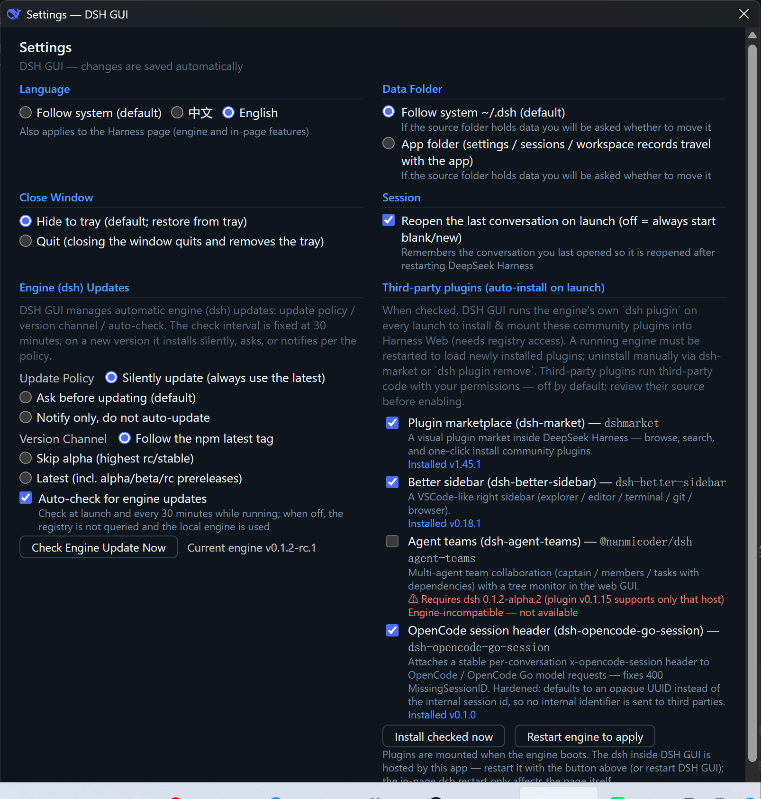

# DeepSeek Harness 桌面壳 DSH GUI v0.2.0：插件管理、多语言、主题同步一次到位

> 掘金 · 完整文章（复制即发）
> 项目地址：https://github.com/itchenshi/DeepSeekHarnessGUI（GitHub 主仓库）
> 国内镜像：https://gitee.com/itchenshi/DeepSeekHarnessGUI / https://gitcode.com/itchenshi/DeepSeekHarnessGUI
> 开源许可：MIT · 非官方独立项目（与 DeepSeek Harness 官方无隶属关系）


## 为什么写这个壳

0.1.0 的 DSH GUI 解决的是「怎么把 Harness 装进桌面窗口」；v0.2.0 解决的是「怎么让这个窗口真正好用」。

DeepSeek Harness 的 Web UI 能力强，但活在浏览器标签页里：会话跟着标签页走、升级靠手动 `npm`、界面只有中文、主题跟壳「两张皮」。这些问题单独看不致命，凑在一起就是「引擎很好，体验跟不上」。

v0.2.0 一次补了三件事，这篇文章展开讲讲。

## 三大新能力

### 1）第三方插件管理：勾选即装

设置窗口内置了**经核实的社区插件目录**：插件市场（dsh-market）、增强侧栏（dsh-better-sidebar）、智能体团队（dsh-agent-teams）、OpenCode 会话头（dsh-opencode-go-session，安全加固版）。


勾选后每次启动自动用引擎 `dsh plugin` 安装并挂载，对账幂等，不覆盖用户手动装的同名插件。

这里有个特别值得说的点：**安全**。第三方插件 = 在你的权限下运行第三方代码，所以目录默认全不勾选；而且内置的 OpenCode 会话头插件是加固版——默认用不透明 UUID、日志脱敏、头值校验，**绝不把内部会话 ID 发给第三方**。

配套的**启动失败自愈**：插件把引擎搞崩，GUI 自动剔除并取消勾选，弹窗一键禁用重启。没有这个机制，我不敢默认开「自动装插件」。

### 2）多语言：免重启热切换

设置窗口「语言」：**跟随系统（默认）/ 中文 / English**。语言选择双向同步到引擎侧（`settings.yaml` → `locale.preference`），引擎热发布 → **切语言不用重启**，选完页面立刻变。



### 3）主题跟随 Harness：一张皮

启动时读 `ui-theme.preference`（light / dark / system），壳窗口和各页面自动对齐；窗口标题显示版本号，托盘同时给 GUI 和引擎版本。不再「引擎深色、壳刺眼白」。


## 其他值得知道的变化

- **win 便携 zip**：NSIS 之外新增，解压即用。
- **CI 构建前清理**：tag 构建先清空 `dist/`，Release 永不混入旧版本安装包（v0.2.0 发行时就踩过这坑）。
- **README 双语重构**：功能分类 + 界面预览截图。

## 快速开始

源码运行（Node ≥ 23）：

```sh
npm install
npm start
```

或用打包产物（[GitHub Releases](https://github.com/itchenshi/DeepSeekHarnessGUI/releases)）：Windows（NSIS + 便携 zip）/ macOS（Intel + Apple Silicon）/ Linux（AppImage + zip），捆绑便携 Node，零安装。

## 写在最后

v0.2.0 的取舍始终一条：**壳只做官方引擎没空做的「体验活」，内核永远 100% 官方**。插件目录后续会随社区生态扩充，欢迎提名。

你在 Harness 上装过哪些插件？希望插件目录收录什么？评论区聊聊。

**建议标签**：`#DeepSeek` `#Electron` `#开源` `#AI编程` `#桌面应用`
