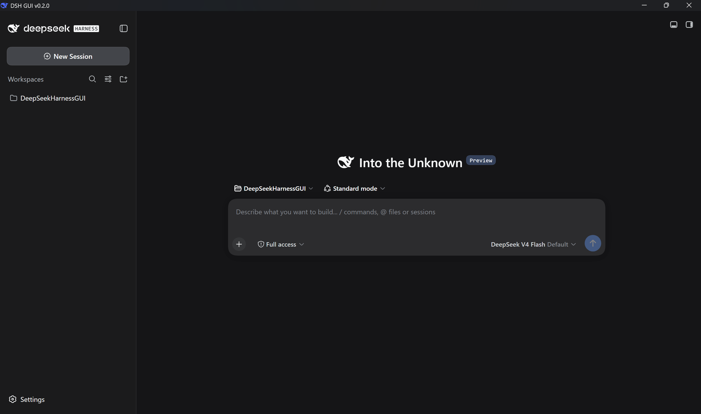
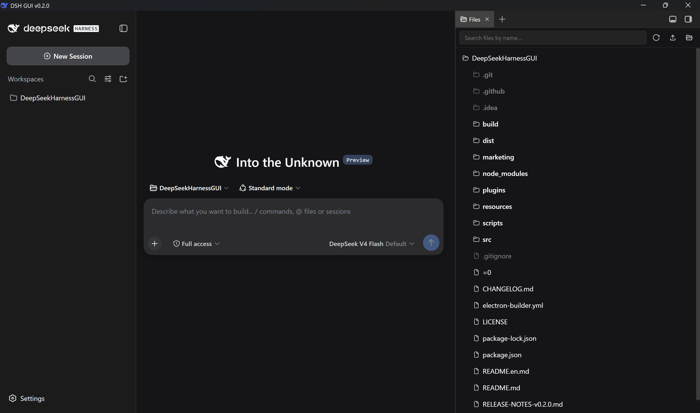

# 【开源】DSH GUI v0.3.0 发布：插件「安装 / 启用」拆成两个状态，用量面板加入 DeepSeek 余额（附完整使用指南）

> 项目地址：https://github.com/itchenshi/DeepSeekHarnessGUI（GitHub 主仓库，安装包以此为准）
> 国内镜像：https://gitee.com/itchenshi/DeepSeekHarnessGUI / https://gitcode.com/itchenshi/DeepSeekHarnessGUI
> MIT · 非官方独立项目 · 与 DeepSeek Harness 官方无隶属关系
> 本版版本号：**v0.3.0**（发布日 2026-09-11）

## 目录

- [一、v0.3.0 更新速览](#一v030-更新速览)
- [二、项目简介与开源平台](#二项目简介与开源平台)
- [三、核心特性（v0.3.0）](#三核心特性v030)
- [四、快速开始](#四快速开始)
- [五、设置项说明](#五设置项说明)
- [六、第三方插件管理](#六第三方插件管理)
- [七、数据目录与隐私](#七数据目录与隐私)
- [八、打包与发布](#八打包与发布)
- [九、常见问题](#九常见问题)
- [总结](#总结)

## 一、v0.3.0 更新速览

| 新能力 | 说明 |
|---|---|
| **用量插件加入 DeepSeek 余额** | `dsh-opencode-go-usage` 更名为 **`dsh-model-usage`（模型用量与余量）**，按会话当前模型分流显示套餐用量或账户余额 |
| **「安装」与「启用」拆成两个状态** | 勾选框管安装/卸载，新增「启用」开关管加载/禁用；两者都与 Harness 页面的插件市场**双向实时同步** |
| **Windows 图标修复** | 白底圆角 + 品牌蓝字形；16~128 用 BMP 帧、256 用 PNG 帧 —— Maye 等老式启动器能显示，Windows「更改图标」不再报「文件不包含图标」 |
| **打包提速** | Node 与 Electron 发行包本地缓存复用，重复打包 0 下载，断网也能构建 |
| **稳定性** | 坏掉的插件安装/卸载不再挡启动（profile 自愈 + 引擎干净重装），已被污染的老安装下次启动自动修复 |
| **设置窗口精简** | 语言/主题统一在 Harness 页面里改，外壳实时跟随；移除冗余勾选项 |

## 二、项目简介与开源平台

**DSH GUI** 是 [DeepSeek Harness](https://www.deepseek.com/harness/)（DeepSeek 开源 Agent 框架，npm 包 `@deepseek-ai/dsh`）的非官方桌面外壳，基于 Electron 实现。它把 Harness 的 Web UI 装进原生桌面窗口：开箱即用、常驻系统托盘、自动保持引擎最新——同时因内核仍是官方 `dsh`，**Harness 的能力被完整保留**。

一句话概括：**内核是官方 `dsh`，外壳负责「运行体验」。**

开源平台一览（三平台仓库互为镜像；安装包以 **GitHub Releases** 为准）：

| 平台 | 角色 | 地址 |
|---|---|---|
| **GitHub** | 主仓库（安装包为准） | https://github.com/itchenshi/DeepSeekHarnessGUI |
| **Gitee** | 镜像 | https://gitee.com/itchenshi/DeepSeekHarnessGUI |
| **GitCode** | 镜像 | https://gitcode.com/itchenshi/DeepSeekHarnessGUI |

> 说明：本文所有截图都放在仓库 `marketing/v0.3.0/` 目录下，正文按**文件名**引用；发布到 CSDN 时请从该目录一并上传，图片才能正常显示。

**主窗口**（对应本节，v0.3.0 实拍）：


英文界面下的同一窗口：



## 三、核心特性（v0.3.0）

### 1. 内嵌窗口，不依赖外部浏览器

壳进程启动 `dsh web --no-open --port 0`，解析 stdout 中带认证的 loopback URL，加载到内嵌 Electron 窗口。不占用浏览器标签页，认证信息不落地。

### 2. 「模型用量与余量」：一次看用量，一次看余额（v0.3.0 重点）

原 `dsh-opencode-go-usage` 更名为 **`dsh-model-usage`**——因为它不再只管 OpenCode Go，而是按**会话当前选中的模型路由**分流：

| 当前模型 | 面板显示 | 数据来源 |
|---|---|---|
| OpenCode Go（`opencode-go` / `opencode`） | 套餐用量：滚动 / 周 / 月百分比 + 重置时间 | 宿主侧取 `OPENCODE_GO_API_KEY` 调 `GET https://opencode.ai/zen/go/v1/usage` |
| DeepSeek（路由 `deepseek-official`） | **账户余额**：总 / 赠送 / 充值（按币种带 `¥` / `$`） | 宿主侧取 `DEEPSEEK_API_KEY` 调 DeepSeek 官方 `GET https://api.deepseek.com/user/balance` |

- 显示位置：**会话标题右侧**，仅在使用对应模型时出现；
- **两段各自独立取数**：宿主路由一次返回两段，每段各自报告成功/失败原因——只配了其中一个密钥，那一半照常可用，另一半退化为诊断文案（`no-key` / `unauthorized`…）而不是整块消失；每段独立 60 秒缓存、失败后 30 秒内不重试；
- **密钥不下发浏览器**：两条上游请求都在宿主侧完成；
- 余额接口返回 `is_available:false` 或余额列表为空时显示「余额不足」并标红；
- **升级平滑**：GUI 会用一次性迁移摘掉旧包名的登记与依赖，并把「原本装着 → 装上替代条目」「原本禁用 → 替代条目同样禁用」一起搬过去，不会新旧两版同时加载、也不会出现用量显示两遍。

### 3. 插件的「安装」与「启用」是两个状态（v0.3.0 重点）

v0.2.0 只有「安装」勾选框；v0.3.0 把**安装**和**启用**拆成两个正交状态，设置窗口两个控件各管一个：

| 控件 | 管什么 | 行为 |
|---|---|---|
| **① 「安装」勾选框** | 安装 / 卸载 | 装了即勾、没装即不勾；勾选**立即安装**、取消**立即卸载**（从 profile 摘掉、保留本地文件），不再持久化「期望」集合 |
| **② 「启用」开关**（新增） | 加载 / 禁用 | 关掉**不卸载**，只是让引擎不加载它（文件与登记都保留）；开启即恢复加载 |

**两者都与 Harness 页面的插件市场双向实时同步**：

- 「启用」开关**走的是插件市场自己的接口**（`POST <引擎>/dsh-market/toggle`，与市场页面上那个开关完全同一条路径），因此在线生效时机、保护规则、`restart` / `refresh` 信号都与市场一致，引擎侧立即生效、**不需要重启**；
- 带**页内半体**的插件（如「模型用量与余量」）禁用后，页面里已加载的那一半不会自己消失——市场为此返回 `refresh: true` 并提示「刷新后生效」，设置窗口同样会出现「**刷新页面**」按钮，点一下页面就与引擎实际组合对齐；
- 市场拒绝的情况（宿主基础设施禁止开关、市场自身不可关、未安装）**原样上报**，不会绕过它的保护去写文件；
- 市场不可用时（未安装 / 引擎没跑 / 老版本没有该路由）自动回退到直接写 profile 补丁层 `cordis.patch.yml`，并同步市场的 `state.json`——在 `patchReload: live` 的 web profile 上同样由引擎在线重组合（实测约 0.7 秒生效）；
- **与市场实时联动**：设置窗口同时 watch `profiles/web/package.json`、`cordis.patch.yml` 和 `.dsh-market/state.json` 三处，任一变化即重算状态指纹并重绘两个控件；禁用来源会标注（`已禁用（插件市场）` / `已禁用（profile 补丁层）`）；
- **状态不一致自动对账**：若市场已禁用但禁用行还没落进补丁层（此时引擎其实仍会加载它），启动维护与「修复 / 重试」会补写成真正的禁用。

安装/卸载是真实耗时的操作（pnpm / 引擎子进程），进行中会显示**进度条 + 阶段文案**并锁定全部控件，结束后恢复——既没有「点了没反应」的观感，也避免两个操作并发改同一个 profile。

设置窗口实拍（对应本节与第五节）：


### 4. 每次都用最新版 Harness

启动时**立即检查一次**，运行期间按**固定 30 分钟间隔**检查 npm registry 的版本表（间隔不可调，可随时点「立即检查引擎更新」）。发现新版按策略处理：

| 策略 | 说明 |
|---|---|
| **询问后再更新（默认）** | 发现新版后询问用户，确认后安装 |
| 静默更新 | 自动安装，不打扰 |
| 仅提示 | 只提示有新版本，不自动更新 |

更新安装到应用私有目录，完成后右下角弹出**持久角标**提醒。

引擎与 GUI 的更新分家：托盘「检查 DSH GUI 更新…」查的是 GitHub Releases，有新版本时打开下载页；引擎更新由 GUI 在后台按设置策略自动处理。此外，dsh 由 DSH GUI 作为子进程托管，页面/插件内建的「重启」无法重启它——需要重启使插件或引擎生效时，用设置窗口的「重启引擎使生效」、页面桥 `window.__dshGui.restartEngine()`，或直接重启 DSH GUI；引擎就绪后意外退出时 GUI 会自动重拉（连续 3 次仍失败则停止并提示）。

### 5. Windows 图标修复（v0.3.0 重点）

- **主图标改为「白色圆角方块 + 品牌蓝字形」**（官方 `#4D6BFE`，带极浅渐变与细描边），深浅壁纸下都醒目；
- **修复 Maye 等老式快速启动工具读不到图标**：此前打包生成的 ICO 全是 PNG 压缩帧，旧解析器只认未压缩 BMP 帧，结果一片空白。现在直接生成 `build/icon.ico`：**16~128 用未压缩 BMP 帧、256 用 PNG 帧**，与官方 `electron.exe` 的嵌入方式一致；
- **修复 Windows「更改图标」报「文件不包含图标」**：修正了 256 帧的格式要求与 BMP 帧的 AND 掩码长度，保证「图标头 / 载荷 / 组条目」三者自洽；
- 附两个自查工具：`scripts/ico-info.cjs`（检查任意 `.ico` 的帧构成与长度自洽性）、`scripts/exe-icon-info.cjs`（检查 exe 内嵌的 `RT_ICON` / `RT_GROUP_ICON`）。

> 提示：Windows 资源管理器与 Maye 会缓存旧图标。重装或新建快捷方式后仍显示旧图标，重启资源管理器（或删除 `%LocalAppData%\IconCache.db`）即可刷新缓存。

### 6. 坏安装 / 卸载不再挡启动

- **profile bundle 自愈**：引擎 spawn 前逐条对账 `dsh.profile.bundles`，修剪解析不到的 stale 登记（这类登记引擎自己的 reconcile 清不掉，`dsh plugin remove` 又会因依赖已不在而报错），合法条目（含引擎自带 bundle）不动；自愈幂等，失败只记日志、不抛异常；
- **引擎安装改为「临时前缀 + 原子替换」**：先装进 `<ENGINE_DIR>.stage`，成功后整体换入，产物布局必然干净，避免老实现增量更新后根目录解析不到 client-ui 包而报 `ERR_MODULE_NOT_FOUND`；
- **引擎树结构自检**：启动时若探测到混合残留，会按当前版本走一次干净重装（24 小时冷却防误判）；已被污染的老安装下次启动即自动修复；
- **第三方插件引起的启动失败自动恢复**：刚自动安装的插件若导致 dsh 无法启动，会自动剔除并取消勾选；疑似插件导致的失败会弹出诊断对话框，可一键禁用并重启。

### 7. 语言与外观跟随 Harness（v0.3.0 调整）

语言与主题统一在 **Harness 页面（引擎设置）** 里修改：DSH GUI 外壳保持「跟随引擎」的默认行为，watch `$DSH_HOME/settings.yaml`（`locale.preference` / `ui-theme.preference`，可取 light / dark / system）热跟随——**在页面里改，外壳自动同步，无需重启**。设置窗口的界面文案与托盘菜单同样跟随语言热切换。

中文 / English 界面对照（对应本节与第五节）：

| 中文界面 | English UI |
|---|---|
|  |  |

### 8. 每次启动都是全新的

内嵌窗口使用**内存会话**（cookies / 登录态不落盘），每次启动全新 spawn dsh 子进程，退出时连进程树一起清理。隐私与整洁兼得。

### 9. 系统托盘与窗口行为

- 主窗口启动即最大化，隐藏时无尺寸闪烁；
- 窗口标题显示 `DSH GUI v<应用版本>`，托盘提示同时给出 GUI 版本与引擎版本；
- 托盘右键菜单：「打开窗口 / 检查 DSH GUI 更新… / 设置 / 退出」；
- 关闭窗口默认**隐藏到托盘**，也可设为「直接退出」（退出时托盘一并移除）；
- 设置窗口为**模态**：打开期间主窗口不可操作、不可关闭。

### 10. 零配置运行时

打包时捆绑便携 Node（默认 **v26**；引擎的会话持久化依赖 Node ≥ 23 的 zstd API）。**终端用户免安装 Node、免 npm**，Windows / macOS / Linux 解压即用。启动时按「捆绑便携版 → `DSH_SHELL_NODE` → 系统 PATH」的顺序解析 Node。

### 11. 会话体验与侧边栏

启动后自动回到最近一次对话（由内置插件 `dsh-gui-last-session` 实现，默认生效），侧边栏与页面能力保持 Harness 原样：


English 版本：



## 四、快速开始

### 方式 A：源码运行（开发 / contributor）

前置要求：Node.js **≥ 23**（含 npm）。

```sh
npm install        # 安装 electron / 构建依赖
npm start          # 启动 DSH GUI
```

首次启动会自动联网安装 DeepSeek Harness 引擎（约 1–2 分钟，状态页有进度）；之后只有 Harness 发布新版本时才需要再次安装。

### 方式 B：使用打包产物（终端用户）

在 [GitHub Releases](https://github.com/itchenshi/DeepSeekHarnessGUI/releases) 获取对应平台产物（Gitee / GitCode 镜像只承载源码与发布说明，不挂安装包）：

| 平台 | 产物 |
|---|---|
| Windows | `DSH GUI Setup 0.3.0.exe`（NSIS 安装包）/ `DSH GUI-0.3.0-win.zip`（便携版）/ `DSH-GUI-WIN.zip`（解压即用目录） |
| macOS | `DSH GUI-0.3.0.dmg`（Intel）/ `DSH GUI-0.3.0-arm64.dmg`（Apple Silicon） |
| Linux | `DSH GUI-0.3.0.AppImage` / `DSH-GUI-LINUX.zip` |

各平台产物均已捆绑便携 Node（v26），**终端用户无需安装任何运行时**，解压即用。

**升级说明**：直接覆盖安装即可，数据目录与会话记录不受影响；若在 v0.2.0 装过「OpenCode Go 用量」插件，首次启动会自动换成「模型用量与余量」，无需手动操作。

## 五、设置项说明

设置持久化于 `<userData>/settings.json`，修改即保存；可通过菜单 `设置 → 打开设置窗口…`（模态）或托盘「设置」进入。v0.3.0 的设置窗口布局为：左列 **关闭窗口 / 数据目录 / 引擎更新**，右列 **第三方插件**。

| 分类 | 设置项 | 默认 | 说明 |
|---|---|---|---|
| 引擎更新 | 更新策略 | **询问后再更新** | 静默更新 / 询问后再更新 / 仅提示 |
| 引擎更新 | 版本通道 | **npm latest** | 另可选「跳过 alpha」「含全部预发布」 |
| 引擎更新 | 自动检查 | 开 | 关闭后不查询 registry，直接用本地引擎（首次无引擎仍做一次性安装） |
| 引擎更新 | 检查间隔 | **固定 30 分钟** | 不可调整；另有启动时的一次检查，可随时「立即检查引擎更新」 |
| 第三方插件 | 自动安装 | **关闭** | 勾选后每次启动用引擎 `dsh plugin` 安装并挂载到 web profile（需联网） |
| 第三方插件 | 启用 / 禁用 | 跟随实际状态 | 与插件市场双向实时同步，在线生效 |
| 数据与桌面 | 数据目录 | **跟随系统 ~/.dsh** | 切换时若源目录有数据会询问是否移动 |
| 数据与桌面 | 关闭窗口 | **隐藏到托盘** | 另一选项「直接退出」（关窗即退出并移除托盘） |

> 说明：v0.3.0 起**语言与主题不再由设置窗口保存**，统一在 Harness 页面里修改，外壳热跟随（见第三节第 7 条）；「自动回到最近对话」的勾选项也已移除，该行为仍默认生效（由 `dsh-gui-last-session` 插件实现）。

## 六、第三方插件管理

- **内置候选目录（经核实的社区插件，展示顺序即此顺序）**：
  1. **插件市场（dsh-market）**
  2. **最近会话恢复（dsh-gui-last-session）**
  3. **模型用量与余量（dsh-model-usage）**
  4. **OpenCode 会话头（dsh-opencode-go-session，加固版）**
- **入口**：设置窗口 → 第三方插件；「安装」勾选框控制装/卸，「启用」开关控制加载/禁用，两个状态都与 Harness 页面的插件市场双向实时同步。
- **「修复 / 重试」按钮**：以「当前已安装集合」为目标再对账（补拉捆绑插件的更新），只增不删，绝不会卸载你手动装的东西；同时对齐启用/禁用状态。刚自动安装的插件若导致引擎起不来，启动维护会把它剔除并取消勾选。
- **安全说明（设置页原文）**：第三方插件等于**以你的权限运行第三方代码**——默认关闭，勾选前请自行审阅源码。
- **卸载**：设置窗口取消勾选、dsh-market 或 `dsh plugin remove` 均可（同一套机制）。
- **内置加固插件**：`dsh-opencode-go-session` 随仓库分发（`plugins/` 目录，本地 file 安装、不依赖 npm 注册表），为发往 OpenCode / OpenCode Go 的请求注入稳定的 `x-opencode-session` 头（修复 400 MissingSessionID）并保持提示缓存亲和；加固做法为默认不透明 UUID、头值校验、debugFile 限位脱敏，不把内部会话 ID 外发给第三方。

## 七、数据目录与隐私

DeepSeek Harness 的全部用户数据都在 `$DSH_HOME`（默认 `~/.dsh`）下，也可切换为应用目录（`<userData>/dsh-home`）；切换时自动检测源目录数据并询问是否**移动**（停引擎 → 迁移 → 按新目录重启）：

| 内容 | 路径 |
|---|---|
| 模型 / 系统 / 插件设置 | `<DSH_HOME>/settings.yaml`（含 `ui-theme.preference`、`locale.preference`） |
| 会话历史 | `<DSH_HOME>/sessions/<编码项目路径>/<会话id>/session.jsonl.zstd` |
| 工作区记录 | `<DSH_HOME>/storages/`（工作区业务文件仍在真实目录） |
| profile 配置与覆盖层 | `<DSH_HOME>/profiles/web/...` |
| 凭证 / 附件 / 匿名 ID | `<DSH_HOME>/credentials…` 等 |

每次启动使用内存会话（cookies / 登录态不落盘），退出时清理整个进程树；会话历史与工作区记录均随数据目录迁移。

## 八、打包与发布

```sh
npm run make-icons      # 渲染各尺寸图标 + Windows 用的 build/icon.ico（BMP 16..128 + PNG 256）
npm run bundle:node     # 便携 Node 就位检查（幂等；压缩包缓存于 resources/.node-cache/）
npm run ensure:electron # electron 发行 zip 本地缓存（首次下载并 SHA-256 校验，之后零网络）
npm run dist:win        # Windows → NSIS 安装包 + 便携 zip + DSH-GUI-WIN 目录 zip
npm run dist:mac        # macOS   → .dmg（需 macOS，含 x64 / arm64 变体）
npm run dist:linux      # Linux   → .AppImage + 目录 zip
```

- **打包提速（v0.3.0）**：Node 压缩包落盘 `resources/.node-cache/` 并配 SHA-256 自校验，`resources/node` 已就位且版本/平台一致时直接跳过——重复打包 **0 下载 0 解压**，删掉 `node` 目录也仍能缓存复用；electron 发行 zip 由 `scripts/ensure-electron.mjs` 首次下载校验后缓存为 `resources/.electron-cache/dist.zip`，`dist:win` 通过 `--config.electronDist` 直接喂给 electron-builder，**不再每轮 Downloading，断网也能重复打包**；
- 三平台产物由 GitHub Actions 在 tag 构建时生成并挂到 GitHub Releases，发布脚本同时推送 Gitee / GitCode（中文发布说明显式按 UTF-8 处理，单平台失败不中断其它平台）；
- 捆绑便携 Node（默认 v26）由 `scripts/after-pack.js` 完整拷入应用（不能用 `extraResources`，会丢 `node_modules`）；Intel macOS 的 Node 通过 `DSH_NODE_ARCH=x64` 在 Apple Silicon runner 上交叉打包；
- AppImage 的 `mksquashfs` 仅 Linux/macOS 可执行，Windows 上请用 CI 或 Docker 构建 Linux 包；
- `npm test` 覆盖插件状态指纹、启用/禁用补丁层读写与市场同步（含 BOM、`[]` 占位、`dependencies` 迁移）、profile 自愈、设置项/主题映射，以及设置窗口内联 JS 的语法与结构约束；`npm run test:e2e` 跑 Windows 端到端（设置窗口与插件市场实时联动、启用/禁用 + 改名迁移 + `/model-usage` 两段路由，断言引擎真实激活态）。

## 九、常见问题

**Q1：首次启动很慢 / 状态页显示「正在下载并安装…」？**

A：正在自动安装 DeepSeek Harness 引擎，仅首次发生，约 1–2 分钟。

**Q2：「安装」勾选框和「启用」开关有什么区别？**

A：勾选框管**装没装**（勾选立即安装、取消立即卸载）；开关管**加载没加载**（关掉不卸载，只是让引擎不加载它，文件与登记都保留）。两个控件都与 Harness 页面的插件市场实时同步，且在市场里改动后设置窗口会立刻跟着变。

**Q3：关掉某个插件后页面里还有它？**

A：那是带页内半体的插件（如「模型用量与余量」）——引擎侧已立即禁用，但页面里**已经加载**的那半不会自己消失。设置窗口这时会出现「**刷新页面**」按钮，点一下页面就与引擎实际组合对齐（与市场的「刷新后生效」提示等价）。

**Q4：升级后用量面板不见了 / 出现了两个用量控件？**

A：v0.3.0 把「OpenCode Go 用量」更名为「模型用量与余量」。GUI 会做一次性迁移：摘掉旧包名的 bundles **与** dependencies 登记，并把你原来的装/禁选择搬到新条目上，正常情况下不会新旧并存。若仍有异常，点设置窗口的「修复 / 重试」再重启一次即可。

**Q5：桌面或开始菜单图标还是旧的？**

A：Windows 资源管理器与 Maye 会缓存图标。重启一次资源管理器（或删除 `%LocalAppData%\IconCache.db`）即可刷新；图标文件本身的帧构成可用 `node scripts/ico-info.cjs build/icon.ico` 自查。

**Q6：`npm run dist` 在 Windows 上报 `mksquashfs ENOENT`？**

A：AppImage 只能在 Linux/macOS（或 CI/Docker）构建，Windows 用 `dist:win` 即可。

**Q7：与官方 CLI 的关系？**

A：本壳只是启动器 / 外壳，运行的仍是官方 `@deepseek-ai/dsh`；任何 Harness 能力问题请参考 [DeepSeek Harness 官方文档](https://deepseek-harness.github.io/deepseek-harness/guide/quickstart)。

## 总结

v0.3.0 是一次「把细节磨平」的版本：插件的**安装**与**启用**终于成为两个各自独立、又与插件市场实时对齐的状态，扩展能力的入口变得可预期；用量面板从「只看 OpenCode Go 套餐」升级为「按当前模型看用量或余额」，两段数据各自独立、密钥不出宿主；Windows 图标问题被从帧构成层面修掉，Windows「更改图标」和 Maye 这类老工具都不再出问题；打包链路加上本地缓存后，贡献者的重复构建成本也降了下来。

对终端用户来说，它仍然是一个免安装运行时、开箱即用的 Harness 桌面壳；对开发者来说，插件状态对账、profile 自愈、引擎原子重装这些实现细节，也都值得 clone 下来读一读。

如果本文对你有帮助，欢迎 **点赞 / 收藏 / 关注**，也欢迎去 [GitHub 主仓库](https://github.com/itchenshi/DeepSeekHarnessGUI) 点个 Star（Gitee / GitCode 镜像同步），有使用问题直接在 Issues 区反馈。
