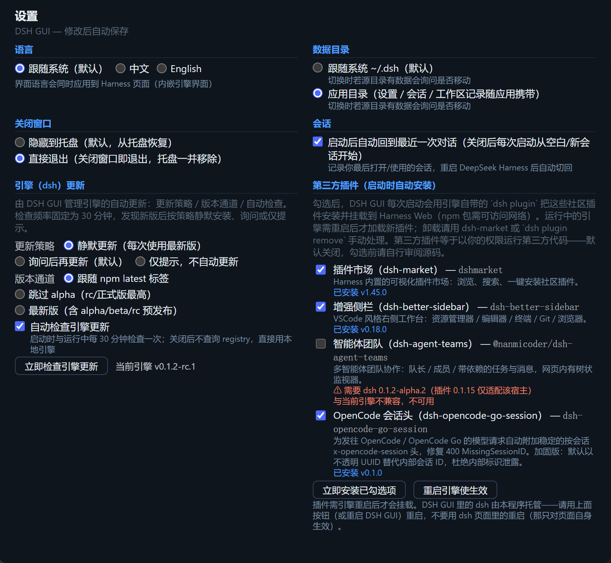
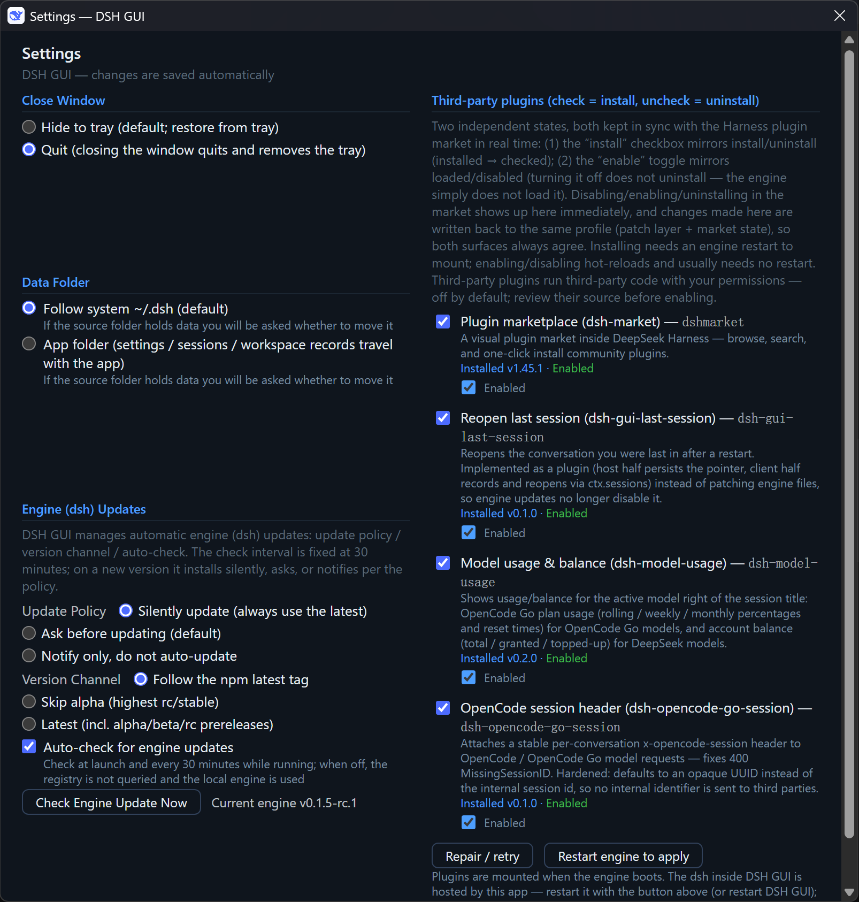

# 用量看得见、插件拆成两步：DSH GUI v0.3.0 把 DeepSeek Harness 的桌面壳又磨了一遍

> 少数派 / 小众软件 · 完整文章（复制即发）
> 项目地址：https://github.com/itchenshi/DeepSeekHarnessGUI（GitHub 主仓库）
> 国内镜像：https://gitee.com/itchenshi/DeepSeekHarnessGUI / https://gitcode.com/itchenshi/DeepSeekHarnessGUI
> 版本：v0.3.0（2026-09-11 发布）
> 开源许可：MIT · 免费 · 跨平台（Windows / macOS / Linux）· 独立开源外壳（内核仍是官方 `@deepseek-ai/dsh`）

## 痛点故事

如果你用 DeepSeek 开源的 Agent 框架 Harness 跑过一段时间，多半踩过这几件事：

Web UI 开在浏览器标签页里，标签一关就找不到了；升级要手动敲 `npm` 命令；用 OpenCode Go 的模型时，套餐用量还剩多少只能去官网翻；用 DeepSeek 官方模型时，账户余额更是要专门打开一次 API 控制台才看得到——而这两件事恰恰是你最想随手知道的信息。

插件那边也有点别扭：以前设置窗口里只有一个勾选框，「装了」和「正在生效」混在一起。想临时关掉一个插件而不卸载它，在 GUI 里做不到；在市场页面里禁用了，设置窗口又不知道。

DSH GUI 就是冲着这些事来的——**给 Harness 一个像样的桌面壳**：下载、解压、双击，完事。v0.3.0 又把用量、插件和 Windows 上的图标这三块磨了一遍。

## 它解决了什么

- **用量与余量显示在会话标题右侧**（v0.3.0）：用 OpenCode Go 模型时显示套餐用量（滚动 / 周 / 月百分比 + 重置时间），用 DeepSeek 模型时显示**账户余额**（总额 / 赠送 / 充值，按币种带 `¥` / `$`；余额不可用或为空时标红提示「余额不足」）。取数在宿主侧完成，**密钥留在本地引擎，绝不下发到浏览器页面**；两段数据各自独立取数，只配了其中一个密钥也能正常用那一半，另一半显示诊断文案而不是整块消失；
- **插件的「安装」与「启用」拆成两个状态**（v0.3.0）：「安装」勾选框管装/卸（勾选立即安装、取消立即卸载）；新增的「启用」开关管加载/禁用——关掉**不卸载**，只是让引擎不加载它。两者都与 Harness 页面里的**插件市场双向实时同步**：市场里禁用/启用，设置窗口立刻显示；来源也会标注（插件市场 / profile 补丁层）。带页内半体的插件切换后，设置窗口会出现「刷新页面」按钮，点一下页面就与引擎实际组合对齐；
- **Windows 图标更醒目了**（v0.3.0）：主图标改为白底圆角 + 品牌蓝字形，在桌面、开始菜单、任务栏和快捷方式上都清楚；`build/icon.ico` 也改为由 `scripts/make-icons.mjs` 直接生成，不再让打包工具从 PNG 转换；
- **打包明显加快**（v0.3.0，主要对贡献者有感）：便携 Node 与 Electron 的发行包都做本地缓存复用，重复打包 0 下载、断网也能构建；
- **自动保持最新引擎**：启动时 + 运行中按**固定 30 分钟**检查 npm registry，发现新版按你的策略处理——**询问后再更新（默认）/ 静默更新 / 仅提示**，右下角有持久角标提醒；GUI 自身的更新与引擎更新分开，托盘里单独查 GitHub Releases；
- **不占浏览器**：内嵌窗口加载 Harness Web UI，不跟你日常网页混在一起；
- **数据目录可控**：默认跟随系统 `~/.dsh`，可切换为应用目录，切换时自动检测源目录数据并询问是否**移动**（停引擎 → 迁移 → 按新目录重启）；`sessions/`、`storages/` 随目录一起走；
- **每次启动都是全新会话**：内嵌窗口使用内存会话（cookies / 登录态不落盘），退出时连整个进程树一起清理；
- **零安装**：安装包捆绑便携 Node（v26），普通用户不需要装 Node、不需要碰命令行。

## v0.3.0 值得单独说的三件事

**一是用量面板。** 会话标题右侧那个小面板按你当前选中的模型自动分流：OpenCode Go 走套餐用量，DeepSeek 官方走账户余额。前者调 `GET https://opencode.ai/zen/go/v1/usage`，后者调 DeepSeek 官方的 `GET /user/balance`，两条请求都在宿主侧用 `ctx.credentials` 取密钥完成。v0.2.0 里这个插件叫「OpenCode Go 用量」，现在它叫**「模型用量与余量」（`dsh-model-usage`）**——升级时 GUI 会自动摘掉旧包、装上新版，连「原本被禁用」的选择一起搬过去，不会新旧两版同时加载。

**二是插件两态。** 「安装」和「启用」现在是两个正交状态，各管各的，且都跟插件市场双向同步。禁用走的是**插件市场自己的接口**（`POST <引擎>/dsh-market/toggle`，与市场页面上那个开关完全同一条路径），所以在线生效时机、保护规则、`restart` / `refresh` 信号都与市场一致——引擎侧立即生效，不需要重启。市场拒绝的情况（宿主基础设施受保护、市场自身不可关、未安装）会原样上报原因，不会绕过保护去写文件；市场不可用时则回退到 profile 补丁层。顺带修掉了一个老问题：profile 的补丁层文件带 UTF-8 BOM，Node 读取时不会剥掉，导致市场写入禁用行时被自己的保护逻辑拒绝——现象就是「市场里禁用了，引擎其实还在加载」。

**三是图标与打包。** 前者影响所有 Windows 用户，后者主要影响自己动手构建的人：`bundle-node.mjs` 幂等化 + 归档缓存（`resources/.node-cache/`，带 SHA-256 自校验），`ensure-electron.mjs` 把 Electron 发行 zip 缓存下来直接喂给 electron-builder，不再有每轮的 “Downloading electron-vXX.zip”。

## 30 秒上手

到 [GitHub Releases](https://github.com/itchenshi/DeepSeekHarnessGUI/releases) 下载你平台的安装包（Windows 有 NSIS 安装包，也有解压即用的便携 zip），打开后首次启动会自动联网安装 Harness 引擎，约 1–2 分钟，之后用完即走。

想看到用量面板的话，插件目录里的「模型用量与余量」需要你在设置窗口勾选安装，并确认对应的密钥（`DEEPSEEK_API_KEY` / `OPENCODE_GO_API_KEY`）已经配置好——密钥留在本地引擎，不会进浏览器。

从 v0.2.0 升级直接覆盖安装即可，数据目录与会话记录不受影响；装过「OpenCode Go 用量」的会被自动换成新版。升级后如果桌面/开始菜单图标还是旧的，重启一次资源管理器（或删掉 `%LocalAppData%\IconCache.db`）刷新图标缓存即可。

## 适合谁 / 不适合谁

**适合**：想在桌面端无痛使用 Harness 的开发者；同时用 OpenCode Go 和 DeepSeek 官方模型、想随手看到用量与余额的用户；不想每次升级手动 `npm i` 的长期用户；以及被「插件装了但关不掉」困扰过的人（现在禁用和卸载分开了，两个都能做）。

**不适合**：只习惯命令行的 Harness 重度用户；对第三方插件安全敏感、且不想审源码的用户（设置里全别勾即可——设置页原文的提示是：第三方插件等于以你的权限运行第三方代码，默认关闭，勾选前请自行审阅源码）。

## 结尾

DSH GUI 是 MIT 开源的独立项目，内核运行的仍是官方 `@deepseek-ai/dsh`。如果你感兴趣，欢迎去仓库点个 Star、反馈问题，或提名你希望收录的插件。

> MIT · 非官方独立项目 · 与 DeepSeek Harness 官方无隶属关系

> 截图建议（均为深色主题，文件就在本目录）：
> - `主窗口.png` — 放在开头的 hero 图和「痛点故事 / 它解决了什么」之后，重点能看出会话标题右侧的用量/余量面板；
> - `设置.png` — 放在「它解决了什么」清单之后，展示左列（关闭窗口 / 数据目录 / 引擎更新）与右列第三方插件的「安装勾选框 + 启用开关」；
> - `DSH设置.png` — 放在「v0.3.0 值得单独说的三件事」之后，展示 Harness 页面内的设置与插件市场；
> - `DSH侧边栏.png` — 放在「30 秒上手」之后，补充会话与侧边栏的观感；
> - `设置-english.png` — 放在「适合谁 / 不适合谁」之后，说明界面为跟随系统 / 中文 / English；
> - 英文界面的 `主窗口-english.png`、`DSH设置-english.png`、`DSH侧边栏-english.png` 可按需替换上面几张。

